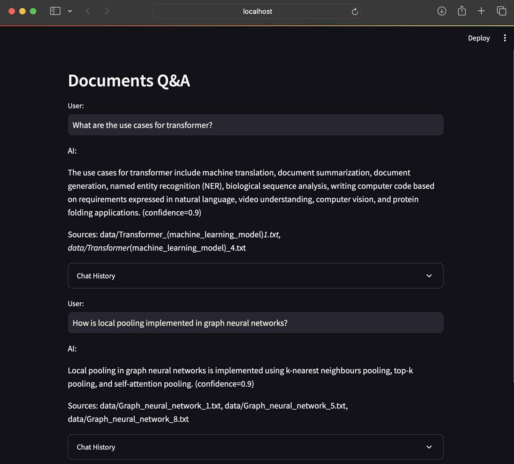

# Retrieval augmented generation (RAG) streamlit app built from LangChain, OpenAI embeddings, and FAISS.



## conversion of pdf to ocr text via pytesseract
```sh
python pdf_to_png_to_ocr_text.py
```
pdf_to_png_to_ocr_text.py produces text documents for every page of every pdf given in the indicated folder in the script ("./data").

## building the index using FAISS
```sh
python ingest_ocr_text_to_index.py
```
ingest_ocr_text_to_index.py uses langchain's CharacterTextSplitter to split text into chunks.
FAISS is used as the index for document text chunks along with source names as metadata.

## streamlit app
To run the app: 
```sh
streamlit run main.py
```

### language chain is built using RetrievalQAWithSourcesChain
RetrievalQAWithSourcesChain uses the following templates:
1. Template below is used to get relevant text.
"Use the following portion of a long document to see if any of the text is 
relevant to answer the question.\n
Return any relevant text verbatim.\n
{context}\n
Question: {question}\n
Relevant text, if any"

2. Template below is used to combine relevant text as the final answer.
"Given the following extracted parts of a long document and a question, 
create a final answer with references ("SOURCES"). \n
If you don\'t know the answer, just say that you don\'t know. Don\'t try to make up an answer.\n
ALWAYS return a "SOURCES" part in your answer.\n\n
... SOURCES:\n\n
QUESTION: {question}\n
=========\n
{summaries}\n
=========\n
FINAL ANSWER:'"

See "template_combine_prompt.txt", which is an adapted version of the above
to spit out confidence scores from LLM.

## References:
- [langchain api](https://api.python.langchain.com/en/latest/api_reference.html)

- Adapted from [langchain examples](https://python.langchain.com/docs/use_cases/question_answering/)

## Dependencies:
Note the packages in the "requirements.txt" file. 
```sh
pip install -r requirements.txt
```
To use OpenAI, add an environment variable "OPENAI_API_KEY" which contains the key. You also need to install 
[tesseract-ocr](https://tesseract-ocr.github.io/tessdoc/Installation.html). 
